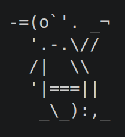
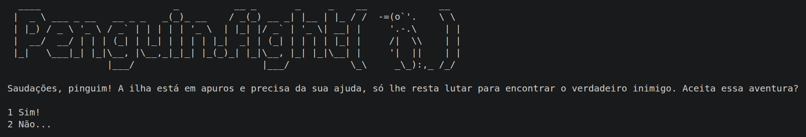
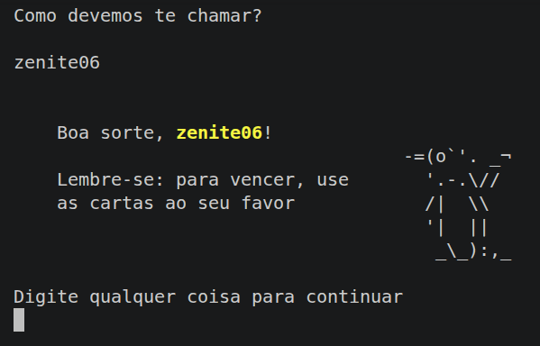
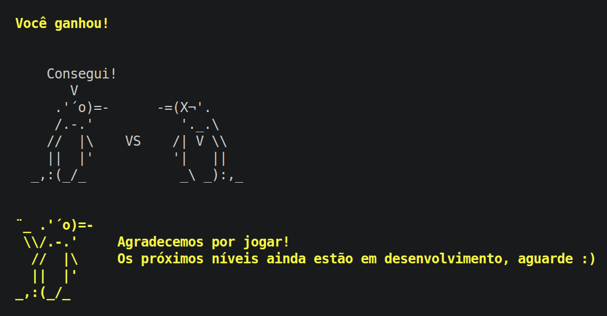

# Projeto MC322 - Penguin.fight()



Saudações, pinguim! Este projeto foi desenvolvido como parte dos laboratórios da disciplina **MC322 - Programação Orientada a Objetos**, com o objetivo de implementar um jogo inspirado em *Slay the Spire*, no qual o jogador utiliza um **baralho de cartas** para derrotar inimigos em batalhas por turno. O projeto desenvolvido aqui foi inspirado pelo antigo jogo online *Club Penguin*, utilizando a linguagem **Java** e sendo executado via terminal.

# Estrutura do Projeto

Utilizando o **Gradle** como ferramenta de automação e build, o projeto segue a estrutura padrão da ferramenta:

```text
.
├─ app/
│  ├─ src/
│  │  └─ main/
│  │     └─ java/
│  │        └─ org/
│  │           └─ penguinfight/
│  │              ├─ App.java
│  │              ├─ RoundManager.java
│  │              ├─ Cartas/
│  │              ├─ Efeitos/
│  │              └─ Entidades/
│  └─ build.gradle.kts
├─ gradle/
├─ gradlew           <-- Script executável para Linux/macOS
├─ gradlew.bat       <-- Script executável para Windows
├─ settings.gradle.kts
├─ .gitignore
└─ README.md

```

## Como Compilar e Executar o Projeto

Graças ao Gradle Wrapper (`gradlew`), você não precisa ter o Gradle instalado na sua máquina para rodar o jogo. No diretório raiz do projeto, utilize seu terminal para executar os comandos abaixo:

**Para compilar o projeto:**
* **Linux/macOS:** `./gradlew build`
* **Windows (PowerShell/CMD):** `.\gradlew.bat build`

**Para executar o jogo:**
* **Linux/macOS:** `./gradlew run -q --console=plain`
* **Windows (PowerShell/CMD):** `.\gradlew.bat run -q --console=plain`

*(As flags `-q` e `--console=plain` servem para ocultar os logs de build do Gradle, deixando o terminal limpo apenas para a interface do jogo).*

## Como Jogar



O jogo foi inspirado pelo minigame *Desafio Ninja*, do antigo jogo online *Club Penguin*. A dinâmica foi modificada, mas consiste em escolher cartas de dano (golpes) e de defesa (bloqueios) a cada turno, com o objetivo de derrotar o inimigo (assim como no jogo *Slay the Spire*).

O jogo atualmente possui três níveis, cada um com seu inimigo próprio, e só acaba quando os três níveis forem vencidos.

No início, digite seu nome para jogar:



Durante o combate:

- O inimigo declara suas ações no início do turno;
- O jogador possui um **baralho de cartas**;
- No início de cada turno, cartas são compradas para a **mão**;
- Cada carta possui um **custo de energia**;
- O jogador pode usar cartas enquanto tiver energia disponível;
- Ao final do turno do jogador, o **inimigo realiza suas ações**.


O combate termina quando:

- o **herói é derrotado**, ou
- o **inimigo é derrotado**.



## O Baralho

O jogo conta com um sistema balanceado de cartas divididas em três categorias principais. Conhecer seu arsenal é o primeiro passo para a vitória!

### Cartas de Ataque
Subtraem a vida do oponente.

| Nome | Custo de Energia | Dano Causado |
| :--- | :---: | :---: |
| **A Cotovelada Improvisada** | 10 | 2 |
| **O Soco Voador** | 20 | 5 |
| **O Chute Periculoso** | 40 | 10 |
| **A Joelhada Triunfal** | 70 | 20 |
| **A Imobilização Fatal** | 90 | 30 |

### Cartas de Defesa
Geram um escudo que absorve o dano recebido no turno atual.

| Nome | Custo de Energia | Escudo Gerado |
| :--- | :---: | :---: |
| **A Esquiva Desajeitada** | 10 | +2 |
| **A Esquiva Normal** | 30 | +2 |
| **A Esquiva Perfeita** | 50 | +8 |
| **O Bloqueio Brutal** | 70 | +10 |
| **O Bloqueio Milenar** | 90 | +15 |

### Cartas de Efeito
Alteram o estado do combate, gerando buffs (melhorias) para você ou debuffs para o inimigo.

| Nome | Custo de Energia | Efeito |
| :--- | :---: | :--- |
| **Aumentar Faixa** | 10 | Aumenta em 2 pontos sua defesa permanente do nível. |
| **Aumentar Faixa x 2** | 20 | Aumenta em 4 pontos sua defesa permanente do nível. |
| **Sardinha** | 20 | Concede +20 de energia bônus para a *próxima* rodada. |
| **Anchova** | 30 | Concede +30 de energia bônus para a *próxima* rodada. |
| **Nevasca** | 50 | Reduz o ataque iminente do inimigo pela metade (50%). |
| **Kit Médico** | 50 | Restaura imediatamente 10 pontos de vida do herói. |
| **Bálsamo Milagroso** | 70 | Restaura imediatamente 20 pontos de vida do herói. |

## Efeitos Inimigos

Tanto o jogador quanto o inimigo possuem acesso ao sistema de Efeitos Observer. Os inimigos aplicarão os efeitos abaixo durante a partida:

* **ÁCIDO** *(Níveis 1 e 2)*: Debuff reativo que causa um dano fixo no jogador sempre que o inimigo realiza um ataque por rodadas pré-determinadas.
* **REGENERAÇÃO** *(Nível 3)*: Efeito passivo que restaura os pontos de vida do inimigo ao final do turno (*spoiler*: caranguejos realmente se regeneram!).

## Rotas

O jogo te dá algumas escolhas por padrão: na tela de início, você pode aceitar ou não a aventura, e no início dos níveis, ao encontrar os inimigos, você pode aceitar confrontá-los ou não. Nesses casos, escolher *"Não..."* não faz o jogo parar, mas apresenta uma mensagem que te manda continuar. Entretanto, negar os conflitos *todas* as vezes te leva a um final com uma mensagem diferente (recomendamos testá-lo!). Essa é a rota relutante, que futuramente deve incluir um nível final com todos os inimigos juntos.

Caso o jogador responda *"Sim"* em alguma dessas escolhas críticas, seguirá a rota padrão, com o término normal do jogo.

# Tecnologias Utilizadas

- Java 25;
- Gradle
- Visual Studio Code;
- Git e GitHub;
- Gemini (Auxílio na geração e revisão de documentação).

# Autores

Projeto desenvolvido por:

- Manuela Daros Misurelli, RA278223;
- Tereza Figueiredo Diniz Zeni, RA278914.